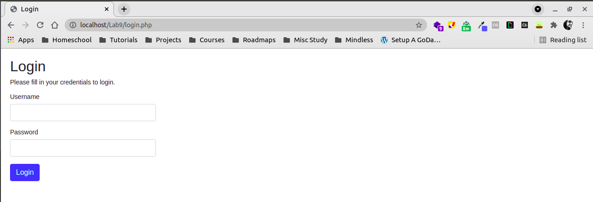
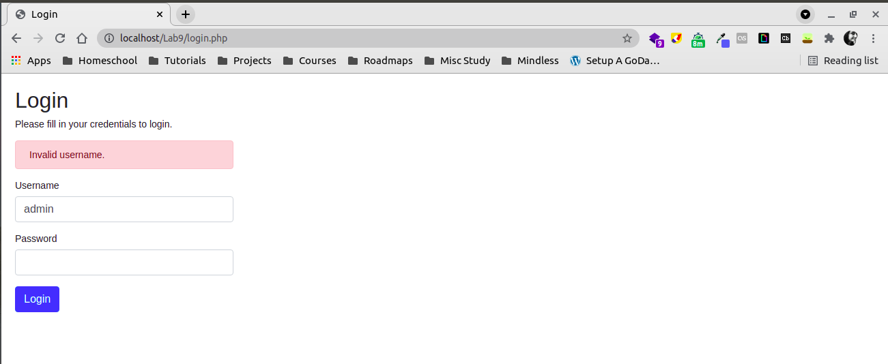
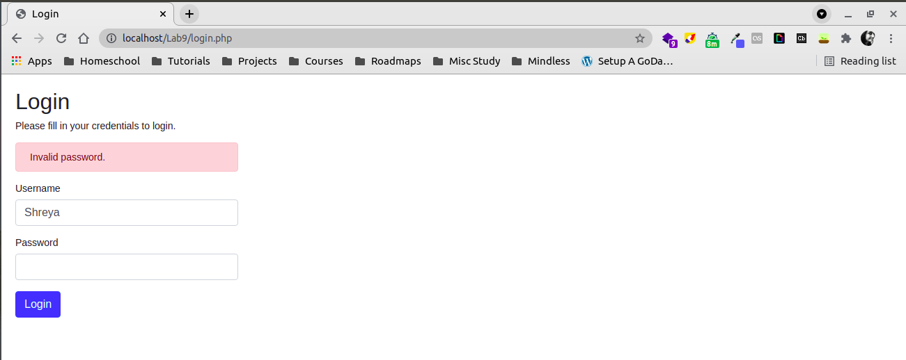
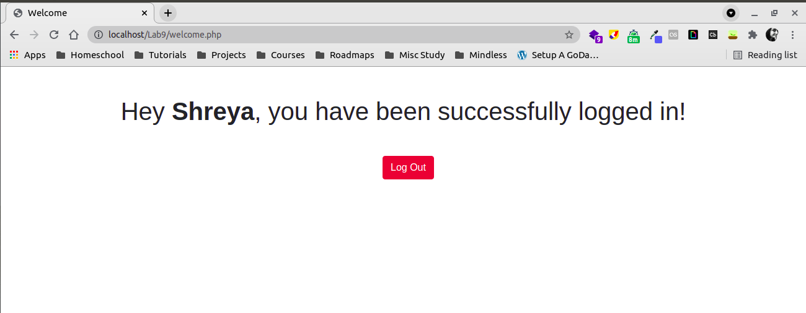

This README contains 3 sections - Problem Statement, Running the PHP application in Ubuntu and Output Screenshots.
You can view the README in your text editor or at this link - https://github.com/Shreya-7/PHPLogin/blob/master/README.md

# Problem Statement   
Develop PHP script for preparing a login screen with user name and password field by validating across the database as stated below. If the login is successful, clear the screen and greet the user, e.g. "Welcome Sidd!" assuming the user name is Sidd.

Create a database under the name of login with user table having user and password fields. Keep the same names as these will be crucial for rapid testing.

Create test data and save in the form of MySQL database.

# Running the PHP application in Ubuntu

## Pre-requisites:   
- PHP7 installed
- MySQL 5.7.34 installed and running
- Apache2 installed

## Steps:
- Setting up MySQL
    - Open your MySQL server
    - Create a database called `login`.
    - Switch to the `login` database.
    - Run the commands in the `db_statements.sql` file. It will create
    a table called `user` and add 2 entries in that table.
- Setting up the program files
    - Modify the `DB_USERNAME` and `DB_PASSWORD` variables in the `config.php` file
    to connect to your MySQL server.
    - After all the changes are done, copy paste the project root directory into your `/var/www/html` directory (you will need `sudo` privileges for this)
- Open `http://localhost/<dir-name>/login.php` in your browser. `dir_name` here stands for the project root directory name, which has been pasted into `/var/www/html` and contains the program files. For this config, the link will be http://localhost/Lab9/login.php

## File Description:
- `config.php` - defines the database connection variables and establishes a connection.
- `db_statements.sql` - contains some SQL queries that are used to setup the local MySQL server.
- `login.php` - contains the logic logic and the logic UI which gets displayed.
- `logout.php` - contains the logout logic. This has been included so that multiple tests can be done.
- `welcome.php` - contains redirect logic if not logged in and the successful logic UI which gets displayed.

# Output Screenshots

Login screen - 

Invalid Username screen - 

Invalid Password screen - 

Successful Login screen - 

